# Homework Report — Bash Scripting & Operations Automation

## Student information

- **Student name:** Nguyễn Tấn Thắng
- **Student ID:** 23127259
- **Class:** 23MMT
- **Submission date:** January 25, 2025

---

## 1. Environment and implementation choices

This assignment was implemented and tested on a Linux virtual machine with the following environment:

| Item | Value |
|---|---|
| Virtualization software | UTM |
| Operating system | Ubuntu Linux |
| Linux hostname | `web01` |
| Linux user | `ubuntu` |
| Web endpoint | `python3 -m http.server` |
| Web data directory | `/home/ubuntu/web01-data` |
| Health URL | `http://localhost:8080` |
| Monitoring configuration | `/etc/monitoring.env` |
| Backup configuration | `/etc/backup.env` |
| Alert method | Local log file |
| Alert log | `/var/log/web01-alerts.log` |
| Health-check cron log | `/var/log/web01-health.log` |
| Backup cron log | `/var/log/web01-backup.log` |

A local directory was used as the backup target:

```text
/srv/backup-target
```

This represents the fallback destination allowed by the assignment when a second Linux VM is unavailable.

A real SMTP relay was not used. Instead, alert emails were written in email-like format to:

```text
/var/log/web01-alerts.log
```

This made all generated alerts observable and suitable for testing and screenshots.

The real configuration files were protected with:

```bash
sudo chown root:root /etc/monitoring.env /etc/backup.env
sudo chmod 600 /etc/monitoring.env /etc/backup.env
```

Only placeholder `.env.example` files are included in the submitted repository.

---

## 2. Submitted project structure

```text
web01-ops/
├── health-check.sh
├── backup.sh
├── restore-test.sh
├── cron/
│   └── web01-ops.cron
├── examples/
│   ├── monitoring.env.example
│   └── backup.env.example
├── evidence/
│   ├── 01-task1-healthy-run.jpg
│   ├── 02-task1-triggered-alert.jpg
│   ├── 03-task2-backup-success.jpg
│   ├── 04-task2-archive-contents.jpg
│   ├── 05-task2-rotation.jpg
│   ├── 06-task2-restore-test.jpg
│   ├── 07-task2-backup-failure.jpg
│   ├── 08-task3-error-trap.jpg
│   ├── 09-task3-shellcheck.jpg
│   ├── 10-task4-cron-schedule.jpg
│   └── 11-task4-cron-log.jpg
├── README.md
├── REPORT.md
└── .gitignore
```

All Bash scripts begin with:

```bash
set -euo pipefail
```

Each script loads its settings from a protected configuration file rather than hard-coding environment-specific values.

---

# Task 1 — Health check with alerting

## 3. Task 1 implementation

The `health-check.sh` script monitors the Linux host and reports problems only when one or more checks fail.

The script reads the following values from `/etc/monitoring.env`:

```bash
ALERT_TO="student@example.com"
DISK_THRESHOLD=85
RAM_MIN_FREE=15
SERVICES="ssh cron"
HEALTH_URL="http://localhost:8080"

MAIL_MODE="log"
MAIL_LOG="/var/log/web01-alerts.log"
```

The following items are checked:

1. Root filesystem usage.
2. Available RAM percentage.
3. Status of every service listed in `SERVICES`.
4. Availability of the web endpoint.

Problems are appended to an array:

```bash
ALERTS=()
```

The script does not send a separate message for every failed probe. It completes all checks and sends one combined alert at the end.

A healthy host:

- Produces no script output.
- Sends no alert.
- Exits with status `0`.

An unhealthy host:

- Continues running all probes.
- Combines all findings into one alert.
- Includes the hostname in the alert.
- Exits with a non-zero status.

---

## 4. Task 1 acceptance test — Healthy host

Before testing, the following conditions were confirmed:

```bash
systemctl is-active ssh
systemctl is-active cron
curl -s http://localhost:8080
```

The web endpoint returned:

```text
hello from web01
```

The health-check was then executed:

```bash
sudo /opt/web01-ops/health-check.sh
rc=$?

echo "health-check exit=$rc"
sudo wc -l /var/log/web01-alerts.log
```

Observed result:

```text
health-check exit=0
0 /var/log/web01-alerts.log
```

There was no output from the script itself and no alert was written.

### Evidence

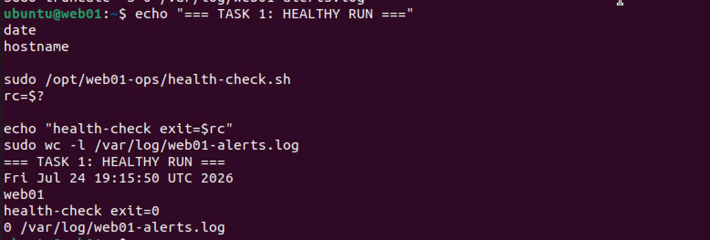

### Result

**PASS** — The healthy host produced no alert and exited with status `0`.

---

## 5. Task 1 acceptance test — Triggered alert

To simulate multiple problems:

1. The Python HTTP endpoint was stopped.
2. `DISK_THRESHOLD` was temporarily changed to `1`.

The health-check was executed again:

```bash
sudo /opt/web01-ops/health-check.sh || true
```

The number of alert messages was checked with:

```bash
sudo grep -c '^Subject:' /var/log/web01-alerts.log
```

Observed result:

```text
1
```

The single alert contained multiple findings, including:

```text
Root filesystem usage exceeded the configured threshold.
Web endpoint is unreachable: http://localhost:8080
```

The alert subject contained the hostname:

```text
Subject: [web01] HEALTH ALERT
```

### Evidence

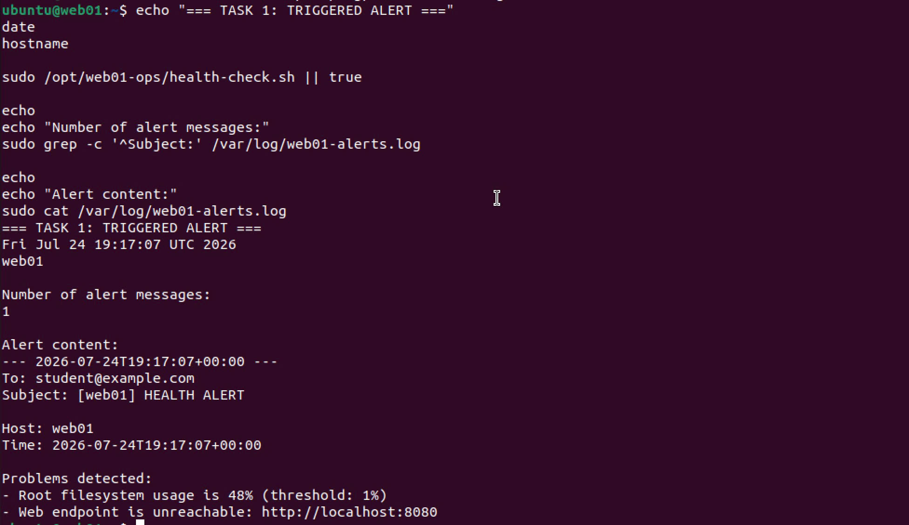

### Result

**PASS** — Exactly one combined alert was produced, and all configured probes were still evaluated.

After testing, the disk threshold was restored to `85`, and the web endpoint was restarted.

---

# Task 2 — Automated backup with safe cleanup

## 6. Task 2 implementation

The `backup.sh` script performs the following operations:

1. Loads variables from `/etc/backup.env`.
2. Validates all required variables.
3. Creates a temporary working directory.
4. Registers an `EXIT` cleanup handler.
5. Generates an MD5 manifest.
6. Creates a compressed timestamped archive.
7. Excludes `.log` and `.tmp` files.
8. Copies the archive to the backup destination.
9. Rotates expired archives.
10. Sends a success report.
11. Sends a failure report if any step fails.
12. Removes its temporary working directory in all cases.

The configuration used was:

```bash
DATA_DIR="/home/ubuntu/web01-data"
ALERT_TO="student@example.com"
DEST="/srv/backup-target"
RETAIN_DAYS=7

MAIL_MODE="log"
MAIL_LOG="/var/log/web01-alerts.log"

FORCE_FAILURE=false
```

Required variables are guarded using parameter validation such as:

```bash
: "${DATA_DIR:?data dir required}"
```

The temporary directory is always cleaned using:

```bash
trap cleanup EXIT
```

If the script exits with a non-zero status, the cleanup function generates a `BACKUP FAILED` alert before removing temporary data.

---

## 7. Task 2 acceptance test — Successful backup

The backup script was run with:

```bash
sudo /opt/web01-ops/backup.sh
```

The destination was inspected using:

```bash
sudo ls -lh /srv/backup-target
```

A timestamped archive was created successfully:

```text
web01-backup-web01-YYYYMMDD-HHMMSS.tar.gz
```

The success report contained:

```text
Subject: [web01] Backup OK
```

It also included:

- Archive name.
- Archive size.
- Destination path.
- Hostname.

### Evidence

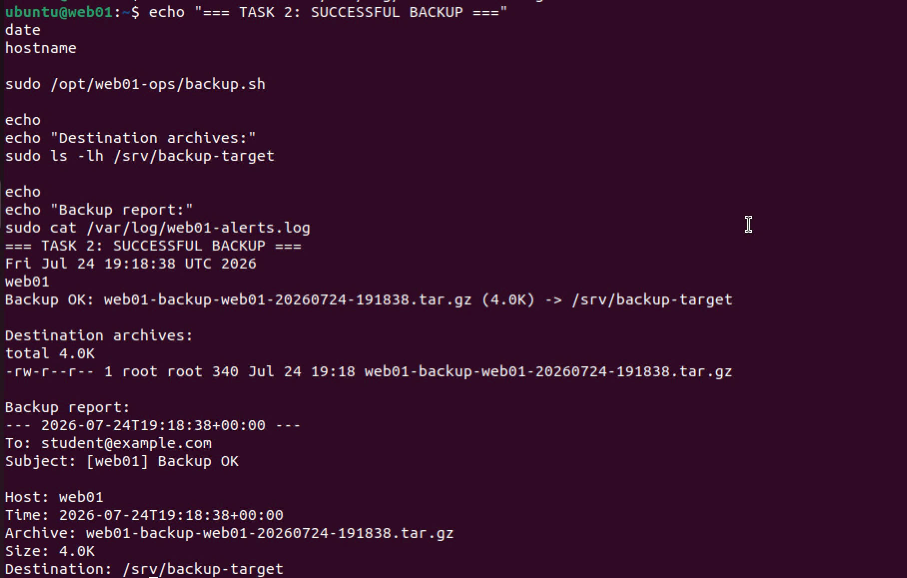

### Result

**PASS** — A valid timestamped `.tar.gz` archive was created at the configured destination.

---

## 8. Task 2 acceptance test — Archive contents and exclusions

The contents of the latest archive were inspected with:

```bash
sudo tar -tzf "$LATEST"
```

The archive contained the manifest and important data files, including:

```text
manifest.txt
data/index.html
data/sub/info.txt
```

The source directory also contained:

```text
debug.log
cache.tmp
```

These files were intentionally created to test the exclusion rules.

The archive was checked using:

```bash
if sudo tar -tzf "$LATEST" |
  grep -Eq '\.(log|tmp)$'; then
    echo "FAILED: .log or .tmp exists in archive"
else
    echo "PASSED: no .log or .tmp in archive"
fi
```

Observed result:

```text
PASSED: no .log or .tmp in archive
```

### Evidence

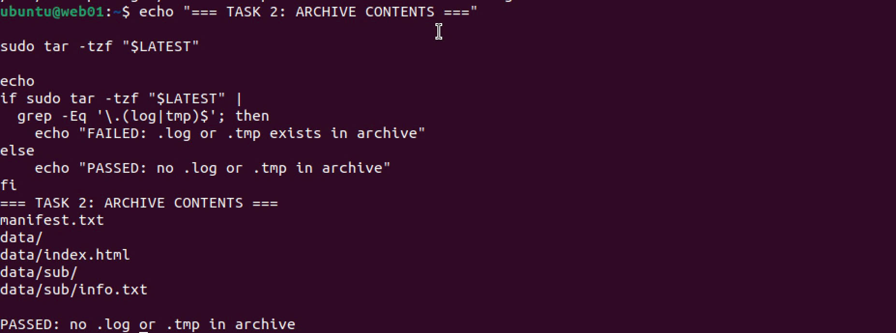

### Result

**PASS** — The archive included the manifest and important files while excluding `.log` and `.tmp` files.

---

## 9. Task 2 acceptance test — Archive rotation

To verify archive rotation, a copy of an existing archive was created and assigned a modification time of ten days ago:

```bash
sudo cp "$LATEST" \
  /srv/backup-target/web01-backup-old-test.tar.gz

sudo touch -d "10 days ago" \
  /srv/backup-target/web01-backup-old-test.tar.gz
```

Because `RETAIN_DAYS=7`, the old test archive should be removed during the next backup.

The backup script was run again:

```bash
sudo /opt/web01-ops/backup.sh
```

The destination was inspected before and after the operation.

Observed result:

```text
PASSED: old archive was deleted
```

### Evidence

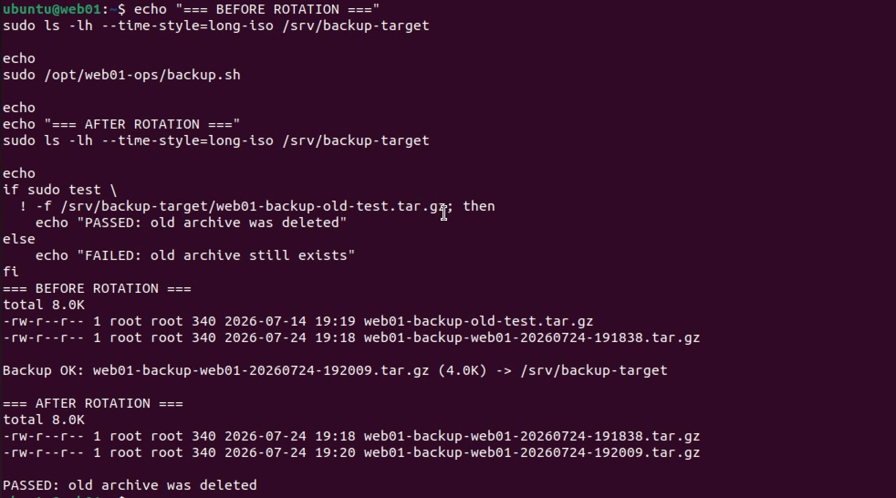

### Result

**PASS** — Archives older than the configured retention period were deleted.

---

## 10. Task 2 acceptance test — Verified restore

The `restore-test.sh` script performs a real restore test rather than only checking whether an archive exists.

It:

1. Selects the latest backup archive.
2. Extracts it into a temporary directory.
3. Locates the included manifest.
4. Runs `md5sum -c` against the restored files.
5. Reports the number of matched files.
6. Removes the temporary restore directory.

The restore test was executed with:

```bash
sudo /opt/web01-ops/restore-test.sh
rc=$?

echo "restore-test exit=$rc"
```

Observed output:

```text
./index.html: OK
./sub/info.txt: OK
Restore test PASSED: 2/2 files matched
restore-test exit=0
```

The exact number of files depends on the contents of the source data directory. In this test, every file recorded in the manifest matched its expected checksum.

### Evidence

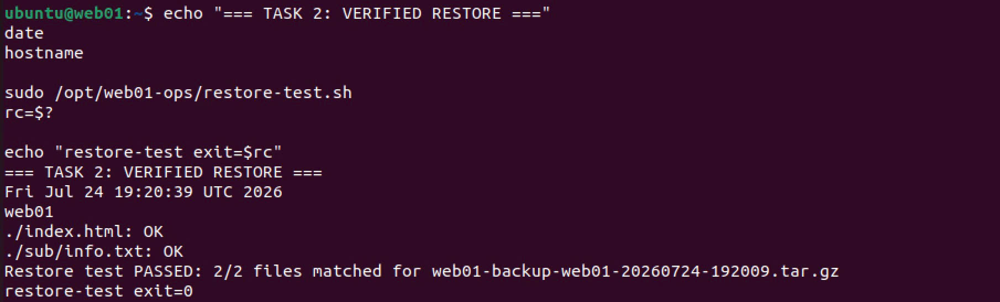

### Result

**PASS** — The latest backup was successfully extracted and every restored file matched the stored manifest.

---

## 11. Task 2 acceptance test — Failure handling and cleanup

A separate test configuration was created with an invalid data directory:

```bash
DATA_DIR="/no/such/path"
```

The backup script was executed using that temporary configuration:

```bash
sudo env BACKUP_CONFIG=/tmp/backup-fail.env \
  /opt/web01-ops/backup.sh || true
```

The test verified two requirements:

1. A `BACKUP FAILED` alert was generated.
2. The temporary working directory was removed.

The cleanup check returned:

```text
PASSED: temporary directory cleaned
```

The alert log contained exactly one failure message:

```text
Subject: [web01] BACKUP FAILED
```

### Evidence

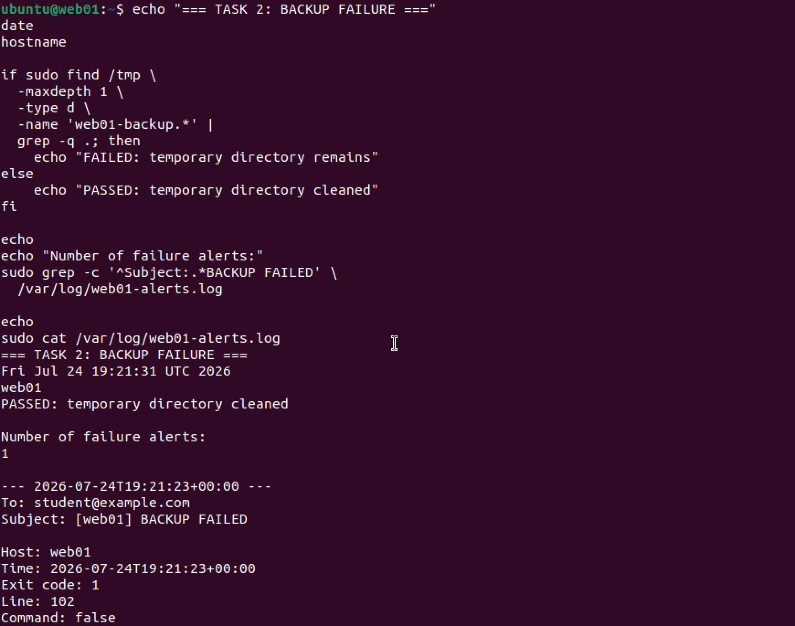

### Result

**PASS** — The failure was reported, and no temporary backup directory remained.

---

# Task 3 — Error trapping and linting

## 12. ERR trap implementation

The backup script contains an error handler connected to the Bash `ERR` trap:

```bash
trap 'on_error $LINENO "$BASH_COMMAND"' ERR
```

The handler captures:

- Hostname.
- Time.
- Failing line number.
- Exact failing command.
- Exit code.

This information is included in the generated failure report.

A controlled fault is enabled through the test-only configuration variable:

```bash
FORCE_FAILURE=true
```

When enabled, the script attempts to execute a real failing command similar to:

```bash
tar -czf "$WORK_DIR/forced-error.tgz" /no/such/dir
```

A marker command exists after the failing command:

```text
THIS LINE MUST NOT RUN
```

This marker is used to verify that execution stops at the failing line.

---

## 13. Task 3 acceptance test — Forced error

The forced-error test was executed with:

```bash
sudo env BACKUP_CONFIG=/tmp/backup-force-error.env \
  /opt/web01-ops/backup.sh \
  > /tmp/forced-error-output.txt 2>&1 || true
```

The output was checked to ensure the marker after the failing command was absent.

Observed result:

```text
PASSED: code after the error did not run
```

The generated error report contained:

```text
Host: web01
Exit code: 2
Line: 128
Command: tar -czf "$WORK_DIR/forced-error.tgz" /no/such/dir
```

The exact line number may change if the script is edited, but the report correctly identifies the actual failing line.

Exactly one `BACKUP FAILED` alert was generated.

### Evidence

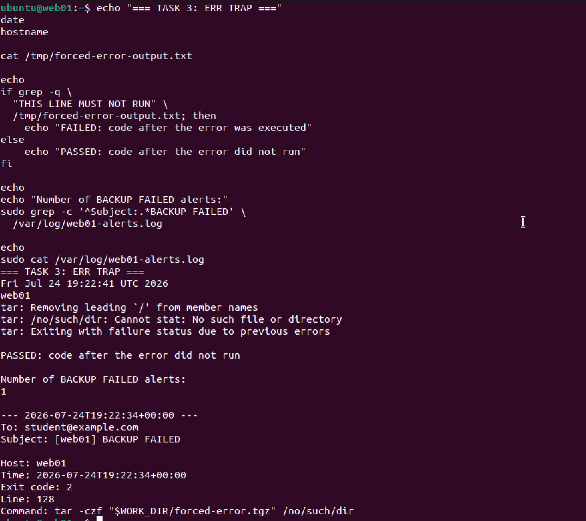

### Result

**PASS** — The real fault stopped execution at the correct command, and the error report included the line number, command, exit code, and hostname.

---

## 14. ShellCheck before correction

During the first ShellCheck run, malformed inline ShellCheck directives were detected.

The incorrect directive format was similar to:

```bash
# shellcheck disable=SC2029 -- explanatory text
```

ShellCheck reported parsing errors including:

```text
SC1072
SC1073
```

The directive was corrected to:

```bash
# shellcheck disable=SC2029
```

### Evidence before correction

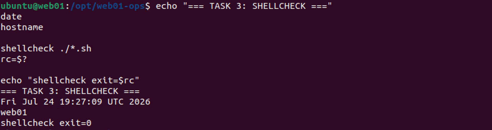

---

## 15. ShellCheck final result

ShellCheck was run on every submitted script:

```bash
cd /opt/web01-ops

shellcheck ./*.sh
rc=$?

echo "shellcheck exit=$rc"
```

Final result:

```text
shellcheck exit=0
```

No warnings or errors were printed.

### Evidence after correction


### Result

**PASS** — All submitted Bash scripts pass ShellCheck with exit code `0`.

---

# Task 4 — Scheduling with cron

## 16. Cron configuration

The project includes:

```text
cron/web01-ops.cron
```

It was installed as:

```text
/etc/cron.d/web01-ops
```

The cron file sets an explicit `PATH` because cron jobs run with a minimal environment.

The required production schedule is:

```cron
*/5 * * * * root /opt/web01-ops/health-check.sh >> /var/log/web01-health.log 2>&1
0 2 * * * root /opt/web01-ops/backup.sh >> /var/log/web01-backup.log 2>&1
```

This means:

- `health-check.sh` runs every five minutes.
- `backup.sh` runs every day at 02:00.
- Output is redirected to files under `/var/log`.

The cron service was confirmed active with:

```bash
systemctl is-active cron
```

Observed result:

```text
active
```

---

## 17. Task 4 acceptance test — Installed schedule

The installed cron configuration was displayed using:

```bash
sudo cat /etc/cron.d/web01-ops
```

The output showed both required jobs:

```text
*/5 * * * *
0 2 * * *
```

### Evidence

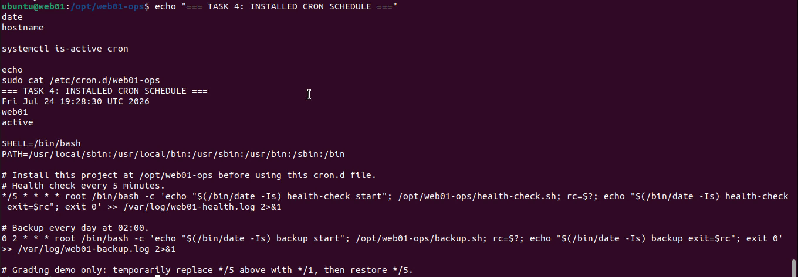

### Result

**PASS** — Both scripts are scheduled with the required production times.

---

## 18. Task 4 acceptance test — One-minute demonstration

For demonstration, the health-check schedule was temporarily changed from:

```cron
*/5 * * * *
```

to:

```cron
*/1 * * * *
```

Before the test:

1. The health log was cleared.
2. The alert log was cleared.
3. The web endpoint was stopped.

Cron then automatically executed the health-check on successive minute boundaries.

The health log showed multiple scheduled executions with different timestamps:

```text
health-check start
health-check exit=1
health-check start
health-check exit=1
```

The alert log also showed that the scheduled health-check detected the stopped web endpoint.

After collecting the evidence, the production schedule was restored to:

```cron
*/5 * * * *
```

The Python web endpoint was also restarted.

### Evidence

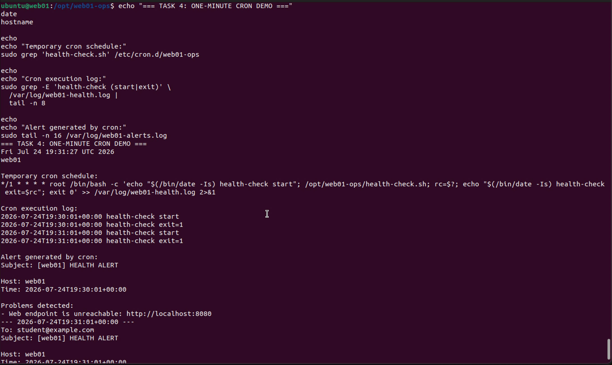

### Result

**PASS** — The health-check ran automatically under cron and detected the triggered failure.

---

## 19. Why a script may work manually but fail under cron

A script that works in an interactive terminal may fail under cron because cron provides a much smaller execution environment.

Common differences include:

1. **Minimal `PATH`**

   Commands such as `curl`, `tar`, `find`, `rsync`, or `python3` may not be found if the cron environment does not include their directories.

2. **Different working directory**

   A cron job does not automatically start in the project directory. Relative paths may therefore point to the wrong location.

3. **Different user**

   A job may run as `root` or another configured user rather than the interactive user.

4. **Different `HOME` variable**

   A path such as:

   ```bash
   ~/web01-data
   ```

   may resolve to `/root/web01-data` when run as root.

5. **Missing interactive shell configuration**

   Files such as `.bashrc` and `.profile` are generally not loaded for cron jobs.

6. **Permissions**

   A cron user may not have permission to read configuration files, write logs, access source data, or write to the destination.

7. **No interactive terminal**

   A cron job cannot answer prompts or display output to a user.

These problems were avoided by:

- Using absolute paths.
- Setting `PATH` in the cron file.
- Using absolute configuration paths.
- Redirecting output to log files.
- Configuring permissions explicitly.
- Avoiding interactive commands.

---

# 20. Acceptance-criteria summary

| Requirement | Evidence | Result |
|---|---|---|
| Healthy health-check is silent | `01-task1-healthy-run.jpg` | PASS |
| Healthy health-check exits `0` | `01-task1-healthy-run.jpg` | PASS |
| Triggered condition sends one alert | `02-task1-triggered-alert.jpg` | PASS |
| All health probes still run | `02-task1-triggered-alert.jpg` | PASS |
| Timestamped archive created | `03-task2-backup-success.jpg` | PASS |
| Backup success report generated | `03-task2-backup-success.jpg` | PASS |
| `.log` and `.tmp` excluded | `04-task2-archive-contents.jpg` | PASS |
| Old archives rotated | `05-task2-rotation.jpg` | PASS |
| Latest backup restores successfully | `06-task2-restore-test.jpg` | PASS |
| Manifest checks all pass | `06-task2-restore-test.jpg` | PASS |
| Backup failure sends alert | `07-task2-backup-failure.jpg` | PASS |
| Temporary directory cleaned | `07-task2-backup-failure.jpg` | PASS |
| Forced error stops execution | `08-task3-error-trap.jpg` | PASS |
| Error alert includes required details | `08-task3-error-trap.jpg` | PASS |
| ShellCheck warnings corrected | `09-task3-shellcheck.jpg` | PASS |
| Final ShellCheck output is clean | `09-task3-shellcheck.jpg` | PASS |
| Health-check scheduled every 5 minutes | `10-task4-cron-schedule.jpg` | PASS |
| Backup scheduled daily at 02:00 | `10-task4-cron-schedule.jpg` | PASS |
| Cron automatically runs health-check | `11-task4-cron-log.jpg` | PASS |
| Triggered cron run produces an alert | `11-task4-cron-log.jpg` | PASS |

---

# 21. Safety and reliability notes

The implementation uses several measures to avoid misleading or unsafe backup results.

## Strict mode

Every script uses:

```bash
set -euo pipefail
```

This helps detect:

- Failed commands.
- Unset variables.
- Failures inside pipelines.

## Temporary working directory

Backup preparation is performed in a temporary directory rather than directly at the destination.

## Cleanup trap

The temporary working directory is removed regardless of success or failure.

## Failure alerting

A non-zero backup result generates a `BACKUP FAILED` message.

## Verified restore

A backup is not treated as fully proven until its files are restored and checked against the included manifest.

## Protected configuration

Real configuration files are stored in `/etc`, owned by root, and assigned permission mode `600`.

## Secret handling

The real `.env` files are not committed to Git. Only `.env.example` files with placeholder values are included.

---

# 22. Git repository history

The project was maintained in a Git repository with separate commits for major implementation stages.

Repository: **https://github.com/thangak18/web01-ops**

Commit history:

```text
e76e973 Add acceptance evidence and final report
752e660 Add cron automation
5d2826b Add gitignore for sensitive configs
ab5e6a0 Add restore verification
c003751 Add verified rotating backup
4ecbea5 Implement host health monitoring
```

---

# 23. Final conclusion

The completed operations toolkit allows the `web01` Linux host to monitor, back up, verify, rotate, and report its own operational state without requiring manual execution.

The final implementation provides:

- Silent health monitoring when the host is healthy.
- One combined alert when problems are detected.
- Timestamped compressed backups.
- Exclusion of unnecessary log and temporary files.
- A checksum manifest for every backup.
- A real verified restore process.
- Automatic cleanup after failures.
- Detailed Bash error trapping.
- Clean ShellCheck output.
- Automatic execution through cron.
- Log-based evidence for scheduled jobs.

All required acceptance scenarios were executed on the Ubuntu VM and documented with labelled evidence.